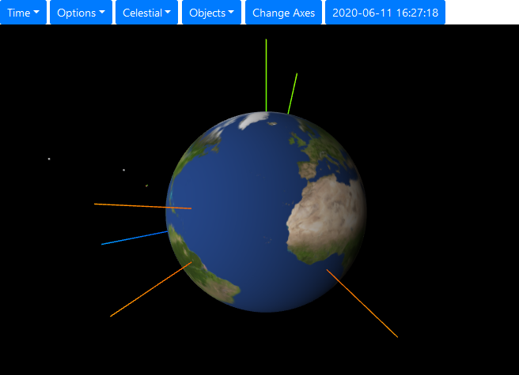
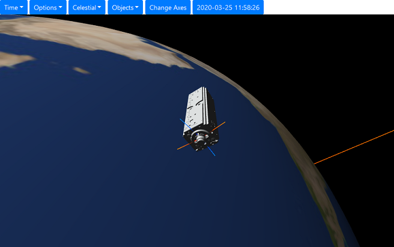

# Web Space Engine

This is a prototype for a web application for 3D visualization of the solar
system and satellites in your browser.

The main features of this project that make it distinct to other to existing open source tools (such as Celestia, NASA GMAT, or Cesium) are:
- Completely browser-based, users do not need to install anything. (For production
    depoyment a central server is needed however.)
- Uses the [three.js](https://threejs.org/) library, which is based on WebGL.
- Application is programmed purely in Python, using [Brython](https://brython.info/) as a Python to Javascript converter.





## Getting Started

- Clone (or download) this repository and prepare virtual environment:

    ```shell
    $ git clone https://gitlab.com/artur-scholz/python-webview3d.git
    $ cd python-webview3d
    $ python -m venv venv
    ```

- Activate virtual environment and install dependencies:

    Linux:

    ```shell
    $ source venv\bin\activate
    $ pip install -r requirements.txt
    ```

    Windows:

    ```shell
    > venv\Scripts\activate
    > pip install -r requirements.txt
    ```

- Run the application:

    Linux:

    ```shell
    $ source venv\bin\activate
    $ export FLASK_APP=app.py
    $ export FLASK_DEBUG=1
    $ flask run
    ```

    Windows:

    ```shell
    > venv\Scripts\activate.bat
    > set FLASK_APP=app.py
    > set FLASK_DEBUG=1
    > flask run
    ```

In your browser, go to http://localhost:5000.

## Development

The `app.py` file starts the flask server and serves the HTML pages containing the generated Javascript code. The main application logic resides in the folder `static/code/main.py`.

Since all the Python code gets converted into Javascript you can only
use a subset of the standard libraries that [Brython](https://brython.info/)
provides.

On the other hand, you can use any Javascript libraries from your Python code.
To do so, it is convenient to provide a Python wrapper module for that Javascript
module. Have a look at how the `three.js` is included, in the `static/code/lib`
folder.
